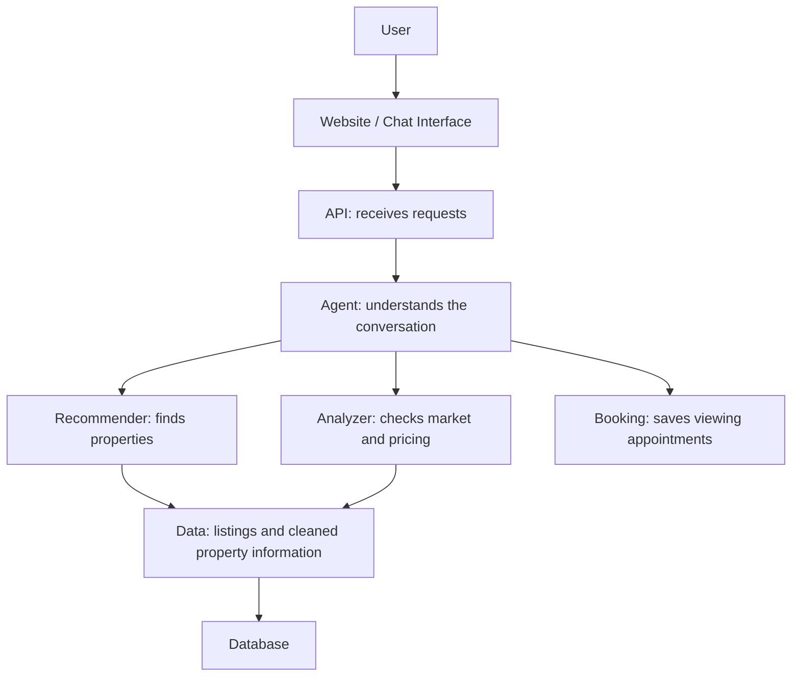
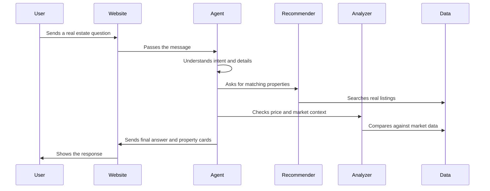
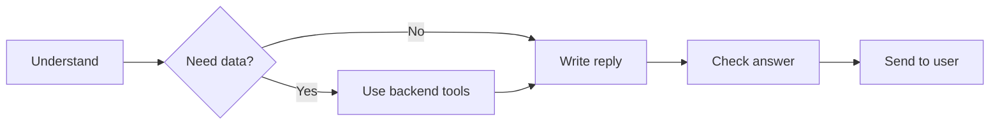

# Estately AI System Documentation

## 1. What Estately Is

Estately is a smart real estate assistant for Egypt's property market.

The user can speak to it in a natural way, like:

- "Find me an apartment in New Cairo under 8 million."
- "Compare villa prices in Sheikh Zayed and Fifth Settlement."
- "Tell me more about the second property."
- "Is this listing overpriced?"
- "Book a visit tomorrow."

The system then understands the request, searches real property data, checks market information, and responds like a helpful real estate consultant.

The most important thing to understand is this:

Estately is not just a chatbot that gives nice answers. It is a group of connected parts working together. One part talks to the user, another part searches properties, another part studies prices, another part stores the data, and another part shows everything nicely on the screen.

We built it this way because real estate advice must be both friendly and trustworthy. A chatbot alone can sound confident, but it might invent prices or properties. Estately avoids that by making the AI explain real data instead of making things up from memory.

## 2. The Big Picture

Think of the system like a real estate office with a few specialized team members:

- The Agent is the front-desk consultant. It understands what the user wants.
- The Recommender is the property matcher. It finds the best listings.
- The Analyzer is the market expert. It checks prices and explains market trends.
- The Data module is the filing room. It keeps the property information organized.
- The API is the service counter. It lets the website and other apps ask the system for help.
- The GUI is the user-facing website and chat screen.

Here is the overall flow:

This structure keeps the system organized. Instead of one big piece trying to do everything, each part has a clear job.

## 3. Why The System Is Split Into Parts

The system is split into modules because each job needs a different kind of thinking.

A user message is messy. People do not speak in database language. They say things like "I want something around Zayed, maybe a villa, not too expensive." The Agent is responsible for turning that sentence into a clear request.

Property search needs discipline. Budget, location, property type, and buy/rent status must be respected. The Recommender handles that.

Market advice needs evidence. If the assistant says a property is fairly priced, it should be based on comparable listings, not just a nice sentence. The Analyzer handles that.

The website needs a clean experience. Users should see messages, property cards, images, and buttons. The GUI handles that.

So the system is separated not to make it complicated, but to make it safer, clearer, and easier to improve later.

## 4. What Happens When A User Sends A Message

Example:

"Find a 3-bedroom apartment in Fifth Settlement under 8 million."

The system handles it like this:

1. The user sends the message from the website or chat screen.
2. The API receives the message and sends it to the Agent.
3. The Agent understands the goal: this is a property search.
4. The Agent extracts the important details: apartment, 3 bedrooms, Fifth Settlement, max budget 8 million, buy or rent if mentioned.
5. The Recommender searches the property data and ranks the best matches.
6. The Analyzer checks whether the recommended properties look fairly priced.
7. The Agent writes a friendly explanation for the user.
8. The Auditor checks that the answer is based on real returned listings.
9. The website displays the answer and property cards.

The key point: the AI writes the explanation, but the properties and prices come from the system's data.

## 5. Project Folder Overview

The project is organized into these main folders:

- `1.Agent`: understands users and manages the conversation.
- `2.Recommender`: finds and ranks property listings.
- `3.Analyzer`: studies market data and price fairness.
- `4.Data`: stores, cleans, and prepares listing data.
- `5.APIs`: exposes the system through web endpoints.
- `6.GUI`: contains the website and chat interface.
- `7.docs`: contains documentation and diagrams.

There are also root-level files:

- `agent_gui.py`: a quick Gradio chat interface for testing.
- `agent_cli.py`: a command-line testing tool.
- `README.md`: setup instructions.
- `requirements.txt`: required Python packages.

## 6. Agent Module

Path: `1.Agent`

The Agent is the system's conversation manager.

It is the part that talks to the user, remembers the conversation, decides what the user wants, and chooses which backend tool should be used.

### Why We Need The Agent

Without the Agent, the user would need to fill a strict form:

- Location.
- Budget.
- Property type.
- Bedrooms.
- Buy or rent.

But real users usually do not speak like forms. They ask naturally, change their mind, compare options, and refer to previous answers.

The Agent makes that possible.

### `1_agent_config.py`

This file stores important settings for the Agent.

It decides things like:

- Which AI model to use first.
- Which backup model to use if the first one fails.
- How many times the system should retry if an answer looks wrong.
- How strict the quality checking should be.

Why this file exists:

It is better to keep these settings in one place. If the team wants to change the AI model or make the system stricter, they do not need to search through many files.

### `3_state_definition.py`

This file describes what the Agent remembers during a conversation.

It remembers things like:

- The conversation messages.
- The user's current search filters.
- Recently recommended properties.
- Booking details.
- Missing information.
- The user's language.
- Which property the user is currently talking about.

Why this matters:

If the assistant recommends three properties and the user says "tell me more about the second one," the system needs to remember what the second one was. This file helps support that kind of natural follow-up.

### `4_graph_builder.py`

This file defines the Agent's workflow.

The workflow has four main steps:

- Brain: understand the user.
- Tools: call the right backend module.
- Tongue: write the final answer.
- Auditor: check that the answer is safe and based on facts.

The names are informal, but the idea is simple:

Why this workflow exists:

Some user messages need a full property search. Others only need a clarification question. For example, "I want a home" is too vague, so the system should ask for location and budget instead of running an expensive search.

### `2_data_bridge.py`

This file connects the Agent to the rest of the system.

It lets the Agent call:

- The Recommender.
- The Analyzer.
- The database.
- The market knowledge system.

It also fixes location names. This is very useful because users may say:

- "Zayed"
- "Sheikh Zayed"
- "New Cairo"
- "Tagamoa"
- "Fifth Settlement"

The database may store those places in a more exact way. The bridge helps match the user's wording to the correct database location.

Why not let the AI guess the location by itself?

Because property search needs exact names. A small mismatch can return the wrong listings or no listings at all. Matching against real database values is more reliable.

### `2_nodes/1_intent_node.py`

This file is the Agent's "understanding" step.

It reads the conversation and tries to answer:

- Is the user searching?
- Are they asking for market analysis?
- Do they want to book a visit?
- Are they asking about a previous property?
- Are they just greeting the assistant?

It also extracts useful details:

- Location.
- Budget.
- Property type.
- Bedrooms.
- Buy or rent.
- Booking information.
- Property references like "the first one" or "listing 123."

It uses AI to understand the sentence, but it also uses safer rule-based checks for important details like budgets and property types.

Why both?

Because AI is good at understanding language, but simple rules are often better for exact things like "8 million" or "3 bedrooms." Combining both makes the system more reliable.

### `2_nodes/entity_extractor.py`

This file contains helper rules for extracting important information.

It recognizes:

- Buy/rent words.
- Common place names.
- Price ranges.
- Property types.
- Follow-up phrases like "show more" or "compare."
- Property references like "the second one."

This file is like a safety checklist. It catches important details even if the AI misses them.

### `2_nodes/2_tool_node.py`

This file is where the Agent actually gets work done.

If the user wants a search, it calls the Recommender.

If the user wants market analysis, it calls the Analyzer.

If the user wants to book a visit, it calls the booking logic.

If the user asks about a previous property, it finds the correct listing and prepares details.

It also handles "show me more" by using saved results instead of starting from zero again.

### `2_nodes/3_translator.py`

This file writes the final answer to the user.

It takes raw results and turns them into a readable consultant-style response.

For example, the Recommender might return:

- Listing ID.
- Price.
- Bedrooms.
- Area.
- Location.
- Score.

The Translator turns that into:

"This apartment is a strong match because it fits your budget, is in Fifth Settlement, and offers a good bedroom count for the price."

It also handles Arabic replies when the user is speaking Arabic.

### `2_nodes/4_auditor.py`

This file checks the answer before it reaches the user.

It looks for problems such as:

- The assistant mentioning a listing ID that was not returned by the database.
- The assistant giving a generic answer when real results exist.
- The assistant failing to answer a follow-up question about a specific property.

Why this matters:

AI can sometimes produce confident but unsupported answers. The Auditor helps keep the response tied to real system data.

### `2_nodes/prompts.py`

This file stores the instructions given to the AI model.

It controls:

- How the AI extracts intent.
- How it writes property recommendations.
- How it answers follow-up questions.
- How it formats market analysis.
- What it must avoid saying.

Keeping these instructions in one file makes the assistant easier to tune.

### `2_nodes/translation_utils.py`

This file supports Arabic and English.

It detects Arabic, translates text when needed, and helps the system continue working internally in a consistent way.

The goal is simple: the user can speak naturally in Arabic or English without the rest of the system needing two separate versions.

### `3_sceduler/booking_logic.py`

This file saves appointment bookings.

It needs:

- Property ID.
- User name.
- Phone number.
- Date.

If those details are available, it stores the booking in the database.

Right now this is a simple booking system. Later, it could be expanded with calendars, agent availability, reminders, and confirmations.

## 7. Recommender Module

Path: `2.Recommender`

The Recommender finds the best property matches.

It is different from the Agent. The Agent understands the user. The Recommender searches and ranks actual listings.

### Why The Recommender Is Needed

A normal filter can answer:

"Show apartments in New Cairo under 8 million."

But a real recommendation system should do more:

- Prefer stronger matches.
- Avoid showing ten nearly identical units.
- Consider listing quality.
- Understand property descriptions.
- Respect budget and location.
- Handle incomplete user details sensibly.

That is why the Recommender uses a mix of search rules and machine learning.

### Simple Explanation Of How It Works

The Recommender works in stages:

1. It creates a clear search profile from the user's request.
2. It gathers possible matching properties.
3. It removes properties that break important rules, like wrong category or over budget.
4. It scores the remaining properties.
5. It sorts them from strongest to weakest.
6. It adds variety so the user does not see repeated versions of the same option.

### `1_config_and_cache.py`

This file stores Recommender settings.

It includes:

- Where model files are stored.
- Which text understanding model is used.
- Which amenities matter.
- Which features the ranking model expects.
- Search thresholds.
- Cache helpers.

Why this matters:

Recommendation models need consistency. The system must use the same settings every time it ranks listings.

### `2_math_and_features.py`

This file prepares the numbers used to compare properties.

It calculates things like:

- How close the price is to the user's budget.
- How similar the property type is.
- How well amenities match.
- How different the area or bedroom count is.
- Whether the property looks expensive compared with its area.
- Whether results are too similar to each other.

This file is important because it turns real estate judgment into measurable signals.

### `3_teacher.py`

This file creates training examples using fictional buyer and renter personalities.

Examples:

- A bargain hunter cares most about price.
- A family buyer cares about space and location.
- A luxury buyer cares about quality and amenities.
- A hidden-gem buyer looks for unusually good value.

Why we did this:

A new platform may not have enough real user behavior yet, such as clicks, saved properties, or bookings. So the system creates realistic training signals using these personas until real user data is available.

### `4_main_orchestration.py`

This file trains the recommendation model.

It:

- Cleans the data.
- Converts property text into searchable meaning.
- Builds a fast search index.
- Creates training examples.
- Trains the ranking model.
- Tests how well the model performs.

This is not run for every user. It is a preparation step used to build the recommendation engine.

### `5_query_adapter.py`

This is the main live search file.

When the Agent needs property recommendations, it calls this file.

It:

- Loads the trained models.
- Checks that the user gave enough information.
- Builds a search profile.
- Finds possible matches.
- Applies strict filters.
- Ranks the results.
- Returns clean property data.

One important rule here is that a useful search needs at least the basics:

- Buy or rent.
- Location.
- Budget.

Without those, the system asks the user for more information instead of pretending it can recommend properly.

### `build_description_index.py`

This file prepares a special search index from property descriptions.

In plain language, it helps the system understand words inside descriptions, such as "garden," "modern," "sea view," or "luxury finishes."

This is prepared in advance because doing it live for every user would be slow.

### `1_model_artifacts`

This folder stores the trained recommendation files.

The system keeps them here so it does not need to retrain every time it starts.

## 8. Analyzer Module

Path: `3.Analyzer`

The Analyzer is the market expert.

It helps answer questions like:

- Is this property fairly priced?
- What is the market like in this area?
- Which area is more expensive?
- What tradeoffs should the user consider?
- Is the budget realistic for the requested area?

### Why The Analyzer Is Separate From The Recommender

Finding a property and judging a market are not the same thing.

The Recommender says:

"Here are good matches."

The Analyzer says:

"Here is what the price and market data mean."

Keeping them separate makes the advice more trustworthy.

### `1_config.py`

This file stores Analyzer settings.

It defines things like:

- Minimum amount of data needed before analysis is trusted.
- Acceptable error targets.
- Outlier rules.
- Where related files are stored.

Why this matters:

Market advice should not be overconfident when there are too few comparable properties.

### `2_ingestion_adapter.py`

This file loads cleaned property data for the Analyzer.

It uses the same cleaning process as the Recommender.

Why this is important:

If two modules clean data differently, they may disagree. One part might think a listing is valid while another part ignores it. Shared cleaning avoids that confusion.

### `3_market_engine.py`

This is the main market calculation file.

It includes:

- Fair price estimation.
- Investment opportunity detection.
- Market snapshots.
- Area comparisons.

The Fair Price Estimator compares a property with similar listings. It looks at location, type, bedrooms, area, price, and furnished status. Then it gives a verdict such as:

- Highly competitive.
- Fair value.
- Premium priced.
- Overpriced.

It also gives a confidence score. This is useful because some markets have lots of comparable listings, while others have limited data.

The Market Pulse gives a wider view of the market:

- How many listings exist.
- How many are for sale vs rent.
- Median prices.
- Price per square meter.
- Days on market.
- Popular hubs.

The Area Comparator compares two places side by side.

### `4_preference_engine.py`

This file looks at the user's request and asks:

"Is this realistic in the current market?"

For example, if the user wants a very large villa in a premium area with a tight budget, the system may suggest a smart adjustment:

- Increase the budget.
- Consider a nearby area.
- Accept a smaller property.
- Look at off-plan options.

This makes the assistant more consultative, not just transactional.

### `5_insight_builder.py`

This file prepares Analyzer results so the AI can explain them clearly.

It turns raw numbers into neat context blocks, such as:

- Asking price.
- Market median.
- Comparable listings count.
- Price percentile.
- Verdict.
- Confidence.

This helps the AI write useful answers without inventing numbers.

### `6_analyzer_evaluator.py`

This file tests the price estimator.

It checks how well the system can estimate known property prices by temporarily hiding one property and predicting it from the rest of the market.

Why this matters:

It gives the team a way to measure whether the pricing logic is actually useful.

### `7_knowledge_engine.py`

This file gives the Analyzer access to market knowledge documents.

The system has written market documents about topics like:

- Developer profiles.
- Regional analysis.
- Investment return.
- Legal and buying process.
- Cairo market overview.

The Knowledge Engine searches these documents for relevant context.

Why this exists:

Listings alone do not explain everything. Market reports and domain knowledge help the assistant give richer advice.

### `8_analyzer_llm.py`

This file asks the AI model to combine the market numbers, user question, and knowledge documents into a clear market answer.

The order is important:

1. Gather facts.
2. Gather market context.
3. Ask the AI to explain them.

This keeps the final answer helpful but still grounded.

## 9. Data Module

Path: `4.Data`

The Data module is where the system's property information starts.

It handles:

- Reading property listings.
- Connecting to the database.
- Cleaning messy data.
- Preparing fields needed by the Recommender and Analyzer.
- Storing market knowledge documents.

### `2_DataBase/db_connector.py`

This file connects to the local database.

The database stores the property information used by the system. It is useful for local development and demos because the project can run with its own prepared data.

Later, the system could move to a stronger production database setup if the platform needs to support larger scale or live property feeds.

### `2_DataBase/db_adapter.py`

This file reads property data from the database and reshapes it into the format the AI modules expect.

It collects information like:

- Property ID.
- Property type.
- Price.
- City and area.
- Bedrooms and bathrooms.
- Area size.
- Amenities.
- Description.

Why this file exists:

The database structure is not always the same as the structure needed by AI models. The adapter translates between the two.

### `2_DataBase/rebuild_database.py`

This file rebuilds the local database from the CSV property dataset.

It creates tables for:

- Cities.
- Zones.
- Property types.
- Property features.
- Properties.
- Feature mappings.

This is useful when the team wants to refresh the local database from source data.

### `preprocessing_engine.py`

This is the main data cleaning file.

It:

- Loads raw property data.
- Converts prices and areas into numbers.
- Removes unusable rows.
- Handles missing values.
- Removes extreme outliers.
- Calculates days on market.
- Creates a listing quality score.
- Calculates price per square meter.
- Turns amenities into searchable columns.

Why this is so important:

Real estate data is usually messy. Prices may be missing, areas may be unrealistic, and text fields may be inconsistent. If the data is not cleaned first, the recommendations and analysis become unreliable.

### `1_Contracts`

This folder contains agreed data formats between modules.

In plain language, it says:

"When one module sends data to another module, this is what the data should look like."

That prevents confusion between parts of the system.

### `3_market_knowledge`

This folder contains text documents used for market understanding.

It also contains a prepared search index so the Analyzer can quickly find relevant parts of those documents.

This is how the system can include general market knowledge, not only listing data.

## 10. API Module

Path: `5.APIs`

The API is how other parts of the product communicate with the backend.

If the GUI is the shop window, the API is the counter behind it. The website asks the API for help, and the API talks to the correct backend module.

### `main.py`

This file creates the FastAPI server.

It provides endpoints for:

- Property search.
- Fair price checks.
- Market pulse.
- Chat with the Agent.

The most important endpoint is the chat endpoint because it uses the full Agent workflow.

It also returns recommended properties in a structured way, so the website can show property cards instead of only text.

### `schemas.py`

This file defines the expected shape of API requests and responses.

This helps avoid confusion. For example, the system knows what a property search request should contain and what a chat response should return.

### `start_api.bat`

This is a helper script to start or restart the API server locally.

It is mainly for development convenience.

## 11. GUI Module

Path: `6.GUI`

The GUI is what the user sees.

It includes:

- A main Estately website.
- A chatbot page.
- Styling.
- JavaScript behavior.
- Images and property card assets.

### `index.html`, `style.css`, `script.js`

These files build the main landing page.

The landing page introduces Estately as a real estate platform. It includes search sections, property cards, platform information, testimonials, and calls to action.

### `chatbot.html`, `chatbot.css`, `chatbot.js`

These files build the chat experience.

The chat page includes:

- A sidebar with capabilities.
- Example prompts.
- English/Arabic toggle.
- Message area.
- Typing indicator.
- Input box.
- Property cards.
- API connection to the backend chat endpoint.

The chatbot page stores a local session ID so the conversation can continue naturally.

### Assets

The assets folder contains images used by the website and property cards.

Some real listings may not have image URLs, so the system can attach demo images to keep the interface visually complete.

## 12. Root-Level Tools

### `agent_gui.py`

This opens a Gradio chat interface.

It is useful for testing the assistant quickly without using the full website.

### `agent_cli.py`

This is a command-line testing tool.

It helps test:

- Chat.
- Search.
- Fair price checks.
- Market pulse.
- Direct Agent behavior.

This is mainly useful for developers and testers.

### `README.md`

This file explains how to install and run the project.

This documentation explains how the system is designed. The README explains how to start it.

## 13. How The AI Is Used

The system uses AI in a careful way.

The AI is used for:

- Understanding natural language.
- Writing friendly responses.
- Translating Arabic and English.
- Explaining market analysis.
- Suggesting tradeoffs.

The AI is not used as the only source of truth.

Property facts come from the database. Rankings come from the Recommender. Price fairness comes from market calculations. The AI's job is to understand and explain, not to invent.

## 14. A Simple Explanation Of The Technical Tools

Some technical names appear in the system. Here is what they mean in simple language.

### LLM

An LLM is the AI language model. It helps the system understand and write human language.

### FAISS

FAISS is a fast search tool. It helps find similar text, such as similar property descriptions or relevant market report sections.

### XGBoost

XGBoost is a ranking model. It helps decide which property should appear before another.

### Database

The database stores the property data used by the system.

### FastAPI

FastAPI is the web service layer. It lets the website send requests to the backend.

### LangGraph

LangGraph controls the conversation steps. It helps the Agent move from understanding, to tool usage, to final response, to checking.

### RAG

RAG means the AI can look up relevant information from documents before answering. In Estately, this is used for market knowledge.

## 15. Why We Use A Hybrid Approach

Estately does not rely on only one technique.

It combines:

- AI language understanding.
- Rule-based checks.
- Clean property data.
- Search indexes.
- Ranking models.
- Market statistics.
- Knowledge documents.

This is intentional.

If we used only AI, the system might sound good but be unreliable.

If we used only filters, the system would be too rigid.

If we used only market statistics, it would not feel conversational.

The hybrid approach lets each part do what it is best at.

## 16. Memory And Follow-Up Questions

The system can remember the conversation.

Example:

1. User asks for apartments in New Cairo.
2. Assistant shows three properties.
3. User asks, "What about the second one?"
4. The system knows which listing was second.
5. User says, "Book a visit tomorrow."
6. The system connects the booking request to that property.

This makes the assistant feel more natural and useful.

## 17. Arabic And English Support

The system supports both Arabic and English.

The backend can detect Arabic, translate it for internal understanding, and then respond back in Arabic.

The GUI also supports Arabic text and right-to-left layout.

This is important because the Egyptian real estate market naturally includes both Arabic and English communication.

## 18. Performance Choices

The system includes several choices to make it faster:

- It loads models once and reuses them.
- It caches repeated searches.
- It keeps cleaned data in memory.
- It runs some checks in parallel.
- It prepares search indexes ahead of time.
- It avoids heavy work when the user has not provided enough information.

These choices make the system more responsive and reduce repeated cost.

## 19. Recommendation Limitation And Future Improvement

The Recommender currently uses simulated buyer behavior for training. Over time, it should learn from real user behavior such as clicks, saves, bookings, and rejected suggestions.

That real feedback would make the recommendations more accurate because the system would learn from how users actually choose properties, not only from simulated buyer profiles.

## 20. Final Summary

Estately is built as a helpful real estate assistant with real backend intelligence behind it.

The user experiences it as one assistant, but inside the system there are several focused parts:

- The Agent understands and manages the conversation.
- The Recommender finds the best listings.
- The Analyzer explains market meaning and price fairness.
- The Data module keeps property information clean and consistent.
- The API connects the backend to interfaces.
- The GUI presents everything to the user.

The main design idea is simple:

Let AI handle language and explanation, but let real data handle facts.

That is what makes the system both friendly and trustworthy.
